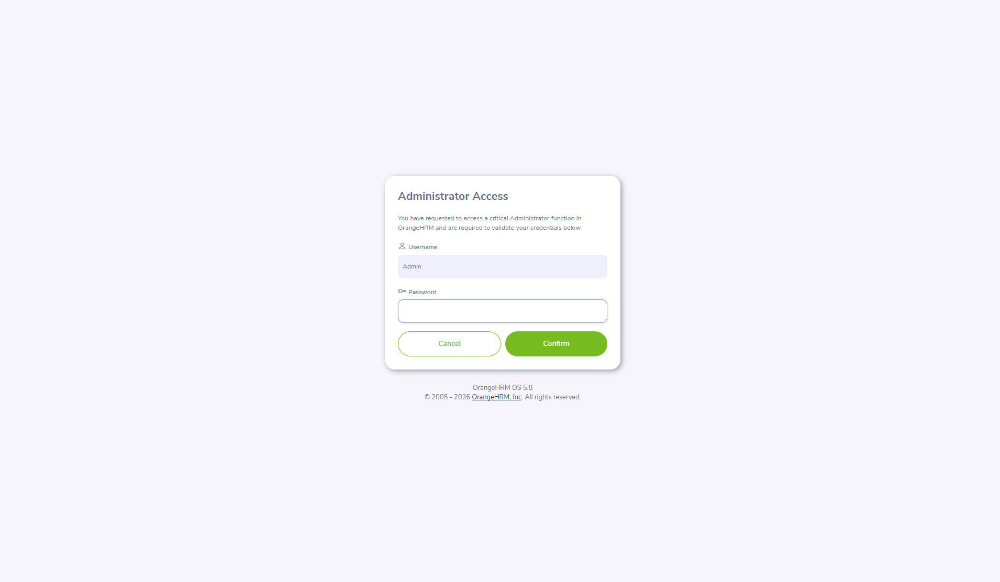

# OrangeHRM Demo — Manual Test Execution Report

**Application under test:** [OrangeHRM Open Source Demo](https://opensource-demo.orangehrmlive.com/web/index.php/auth/login)  
**Execution date:** 2026-03-24  
**Tooling:** Playwright MCP (`user-playwright-mcp`), Chromium, **headed** mode (`headless: false`)

## Test environment

| Item | Value |
|------|--------|
| Browser | Chromium (via Playwright MCP) |
| Display mode | Headed (visible browser window) |
| Viewport / window | **1920 × 1080** — used to approximate a maximized desktop window; after navigation, `window.outerWidth` / `window.outerHeight` reported **1920 × 1080** |
| OS | Windows (per test machine) |

---

## Step-by-step results

| Step | Description | Result | Notes |
|------|-------------|--------|--------|
| 1 | Launch Chrome in maximized state | **Pass** | Playwright MCP launched Chromium in headed mode with **1920×1080** viewport; dimensions matched full window size in this run. |
| 2 | Navigate to `https://opensource-demo.orangehrmlive.com/web/index.php/auth/login` | **Pass** | Navigation completed within timeout. |
| 3 | Verify application launched and login page is shown | **Pass** | Page title **OrangeHRM**; visible controls **Username**, **Password**, **Login**, **Forgot your password?**; URL matched login route. |
| 4 | Enter username **Admin** and password **admin123** | **Pass** | Fields filled via `input[name="username"]` and `input[name="password"]`. |
| 5 | Click Login | **Pass** | `button[type="submit"]` clicked successfully. |
| 6 | Wait for home page to load | **Pass** | Landed on dashboard: `.../web/index.php/dashboard/index`. |
| 7 | Verify all left menus on the home page | **Pass** | **10** top-level sidebar items detected under `.oxd-navbar-nav` (see table below). |
| 8 | Click each menu item; verify clickable | **Pass** (with note) | All items responded to click when the sidebar was unobstructed. **Exception:** After opening **Maintenance**, an **Administrator Access** modal appeared; the **Claim** menu was not reachable until **Cancel** was used to dismiss the modal (first automated click to **Claim** timed out). See failure-context screenshot below. |
| 9 | Record URL after each menu click | **Pass** | Captured URLs listed in the menu navigation table. |
| 10 | Click profile icon | **Pass** | `.oxd-userdropdown-tab` opened the user menu. |
| 11 | Log out; verify logout successful | **Pass** | **Logout** was clicked; URL returned to `.../auth/login` with login form visible. |

---

## Left menu inventory and URLs after navigation

The following table lists each **left navigation** item (as shown on the dashboard), whether the click succeeded in this run, and the **actual URL** after navigation (OrangeHRM often routes to a default sub-page rather than the generic `view*Module` path).

| # | Menu item | Clickable | URL after navigation |
|---|-----------|-----------|----------------------|
| 1 | Admin | Yes | `https://opensource-demo.orangehrmlive.com/web/index.php/admin/viewSystemUsers` |
| 2 | PIM | Yes | `https://opensource-demo.orangehrmlive.com/web/index.php/pim/viewEmployeeList` |
| 3 | Recruitment | Yes | `https://opensource-demo.orangehrmlive.com/web/index.php/recruitment/viewCandidates` |
| 4 | My Info | Yes | `https://opensource-demo.orangehrmlive.com/web/index.php/pim/viewPersonalDetails/empNumber/7` |
| 5 | Performance | Yes | `https://opensource-demo.orangehrmlive.com/web/index.php/performance/searchEvaluatePerformanceReview` |
| 6 | Dashboard | Yes | `https://opensource-demo.orangehrmlive.com/web/index.php/dashboard/index` |
| 7 | Directory | Yes | `https://opensource-demo.orangehrmlive.com/web/index.php/directory/viewDirectory` |
| 8 | Maintenance | Yes | `https://opensource-demo.orangehrmlive.com/web/index.php/maintenance/purgeEmployee` (opens **Administrator Access** credential dialog) |
| 9 | Claim | Yes (after modal dismissed) | `https://opensource-demo.orangehrmlive.com/web/index.php/claim/viewAssignClaim` |
| 10 | Buzz | Yes | `https://opensource-demo.orangehrmlive.com/web/index.php/buzz/viewBuzz` |

**Anchor `href` values on the menu (for reference):** each item’s link in the DOM pointed to the corresponding `view*Module` / module entry URL; the application then redirected to the concrete screen shown above.

---

## Failures and screenshots

Failures are documented when automation could not complete an action without recovery.

### 1. Step 8 — Claim menu not clickable while Maintenance modal is open

- **Symptom:** After navigating to **Maintenance**, the **Administrator Access** modal covered the UI; an automated click on **Claim** (`.oxd-navbar-nav a[href*="viewClaimModule"]`) **timed out** (sidebar link not interactable).
- **Recovery:** Click **Cancel** on the modal, then click **Claim** again — **Pass**.
- **Screenshot (failure context):**  
  

---

## Evidence files

| File | Purpose |
|------|---------|
| `screenshots/step_8_maintenance_modal_blocks_sidebar-2026-03-24T04-26-33-275Z.png` | Full-page capture while Maintenance administrator dialog is shown (illustrates why Claim was not clickable until **Cancel**). |

> **Note:** If `screenshots/step_6_failed.png` is present in the folder, it is from an **earlier** run and is **not** part of this execution’s outcome (Step 6 **passed** in the run documented above).

---

## Overall verdict

**Pass** — Login, dashboard access, verification of all **10** left-menu items, URL capture per menu, profile menu access, and logout to the login page completed successfully. The only automated issue was the **Maintenance** modal blocking **Claim** until the modal was dismissed; behavior is called out above with a linked screenshot.
