# OrangeHRM Open Source Demo — Functional & Test Requirements

**Application under test:** OrangeHRM (hosted demo)  
**Base URL:** `https://opensource-demo.orangehrmlive.com`  
**Login URL:** `https://opensource-demo.orangehrmlive.com/web/index.php/auth/login`  
**Observed product version (footer):** OrangeHRM OS 5.8  
**Reference credentials (demo):** Username `Admin` / Password `admin123`  
**Requirements capture method:** Live session via Playwright MCP (navigation, DOM/HTML inspection, JavaScript evaluation for menu `href`s). Successful login redirected to `.../web/index.php/dashboard/index`.

**Screenshots:** PNG files live in [`screenshots/`](screenshots/) next to this document. They were captured on **2026-03-24** against the public demo; UI may change slightly over time. Where a check is **not** visible in a screenshot (for example, console errors, HTTP headers, or disabled JavaScript), the cell states **how to verify** instead.

---

## How to use the screenshot column

- **Inline images** show the expected look of the page, form, or error state for that requirement.
- **“Same as …”** means use the same figure as the referenced requirement ID (avoid duplicating large images).
- **“N/A (tools)”** means validation is not visible in a static image — use DevTools, network tab, or other tools as noted.

---

## 1. Document scope

This document lists **requirements to verify** the **login page** (every visible/control element), **post-authentication home/dashboard** behavior, **left main menu** items (labels, destinations, and checks), and **additional QA validation** guidance for execution. It is written for **manual and automated** testing against the demo environment; production deployments may differ (branding, modules enabled, permissions).

---

## 2. Login page — detailed requirements

### 2.1 Page shell & global behavior

| ID | Requirement | Screenshot / verification |
|----|-------------|---------------------------|
| LP-01 | Page loads without unhandled script errors in the browser console under normal conditions (record and triage any errors). | **N/A (tools).** Open DevTools → **Console** on the login page; compare with baseline. Reference layout: same session as `login-full-desktop.png`. |
| LP-02 | Document title is appropriate (observed: `OrangeHRM`). | 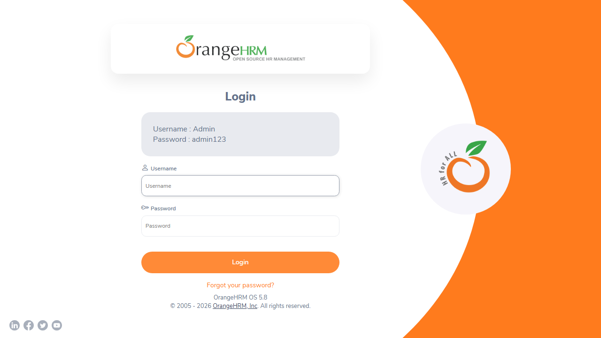 |
| LP-03 | Favicon is present and loads (observed path pattern: `/web/dist/favicon.ico` with cache-busting query). | **N/A (tools).** Check browser tab icon and **Network** for `favicon.ico`. Layout context:  |
| LP-04 | **NoScript:** When JavaScript is disabled, the user sees the message that the application does not work without JavaScript. With JavaScript enabled, the SPA mounts and the login UI is interactive. | **Part A — JS on:** . **Part B — JS off:** Disable JavaScript in browser settings; expect `noscript` message only (capture locally if needed). |
| LP-05 | Viewport meta tag is present for responsive behavior. | **N/A (tools).** View page source / Elements → `meta[name=viewport]`. Responsive example: 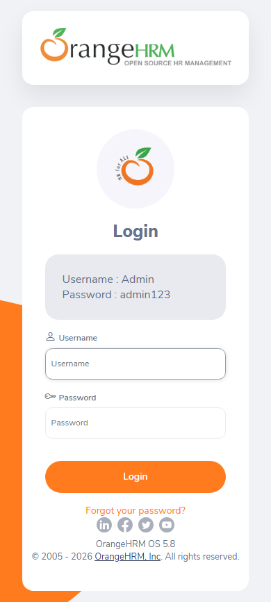 |
| LP-06 | Stylesheets load (chunk-vendors / app CSS); layout is not broken (no overlapping unreadable text). |  |

### 2.2 Branding & logos

| ID | Requirement | Screenshot / verification |
|----|-------------|---------------------------|
| LP-10 | **Company branding image** is visible in the login layout. Verify image renders, no broken image icon, and alt text is meaningful. |  |
| LP-11 | **OrangeHRM logo** appears in the login slot and/or beside the layout. Verify presence, no distortion, and alt text. |  |
| LP-12 | Logos and layout behave acceptably at common breakpoints (desktop, tablet, narrow mobile): no clipped controls, tap targets remain usable. | **Desktop:**  **Mobile (iPhone 13 preset):**  |

### 2.3 Page title & demo credentials callout

| ID | Requirement | Screenshot / verification |
|----|-------------|---------------------------|
| LP-20 | **Primary heading** “Login” is visible (observed: `h5` with class `orangehrm-login-title`). |  |
| LP-21 | **Demo credentials** sheet is visible on the demo site (gray sheet with `Username : Admin` and `Password : admin123`). |  |
| LP-22 | **Non-demo environments:** If this callout must not appear, assert it is absent or hidden (environment-specific). | **N/A** — not applicable on this demo; for other builds, screenshot absence of `orangehrm-demo-credentials`. |

### 2.4 Login form — structure & fields

| ID | Requirement | Screenshot / verification |
|----|-------------|---------------------------|
| LP-30 | Form is present (`form.oxd-form`, `method="post"`, `action` → `/web/index.php/auth/validate`, `novalidate`). |  |
| LP-31 | **CSRF / session token:** Hidden `input` `name="_token"` is present with non-empty value before submit. | **N/A (tools).** Inspect DOM on login page → `input[name="_token"]`. Form context:  |
| LP-32 | **Username** field: `name="username"`, placeholder `Username`, label “Username”, icon. |  |
| LP-33 | **Password** field: `type="password"`, masked value (not clear text). | 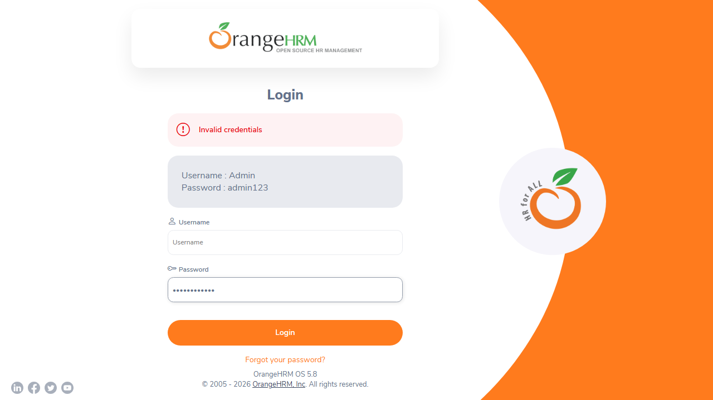 |
| LP-34 | **Login button:** `type="submit"`, label “Login”, primary styling. |  |

### 2.5 Field-level & form-level validations

| ID | Requirement | Screenshot / verification |
|----|-------------|---------------------------|
| LP-40 | **Empty username:** Submit with blank username — inline validation / toast; remain on login. | 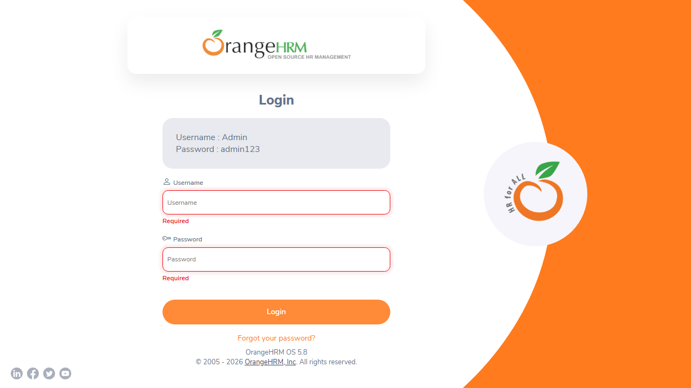 |
| LP-41 | **Empty password:** Submit with blank password — same as LP-40. | **Same as LP-40:**  |
| LP-42 | **Both empty:** Same as LP-40/LP-41. | **Same as LP-40:**  |
| LP-43 | **Invalid credentials:** Wrong username/password — invalid credentials message; no dashboard. | 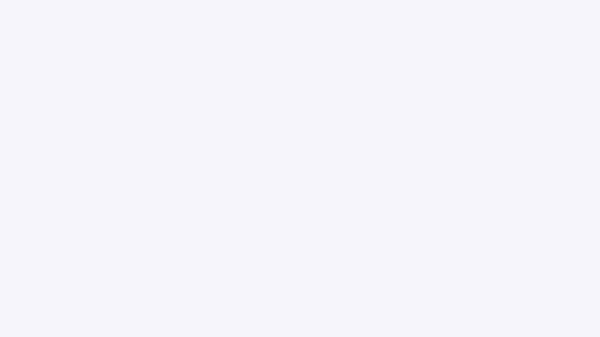 |
| LP-44 | **Case sensitivity:** Verify username/password case rules per spec. | **Same as LP-43** for wrong password outcome, or capture “Admin” vs “admin” if behavior differs:  |
| LP-45 | **Leading/trailing spaces:** Trim or reject — document actual behavior. | **N/A (retest).** Capture locally after entering spaces; reference form:  |
| LP-46 | **SQL injection / XSS strings:** No crash, no script execution; safe error handling. | **N/A (tools + retest).** Use test strings; compare with error pattern similar to  |
| LP-47 | **Very long input:** Max length / overflow — UI stable. | 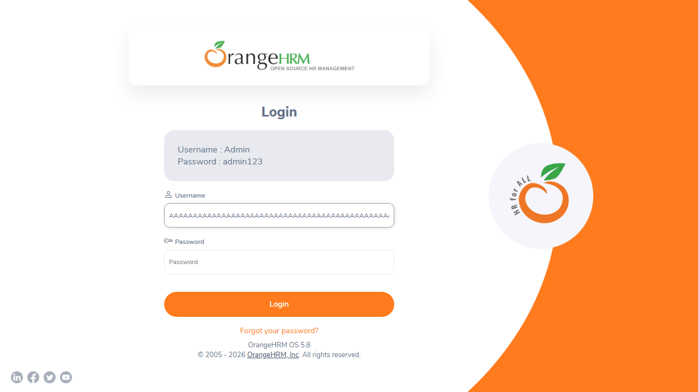 |
| LP-48 | **Concurrent submits:** Double-click Login — document expected behavior. | **N/A (video/GIF).** Use screen recording; static reference for button:  |

### 2.6 Successful authentication

| ID | Requirement | Screenshot / verification |
|----|-------------|---------------------------|
| LP-50 | Valid `Admin` / `admin123` → redirect to authenticated area (`.../dashboard/index`). | 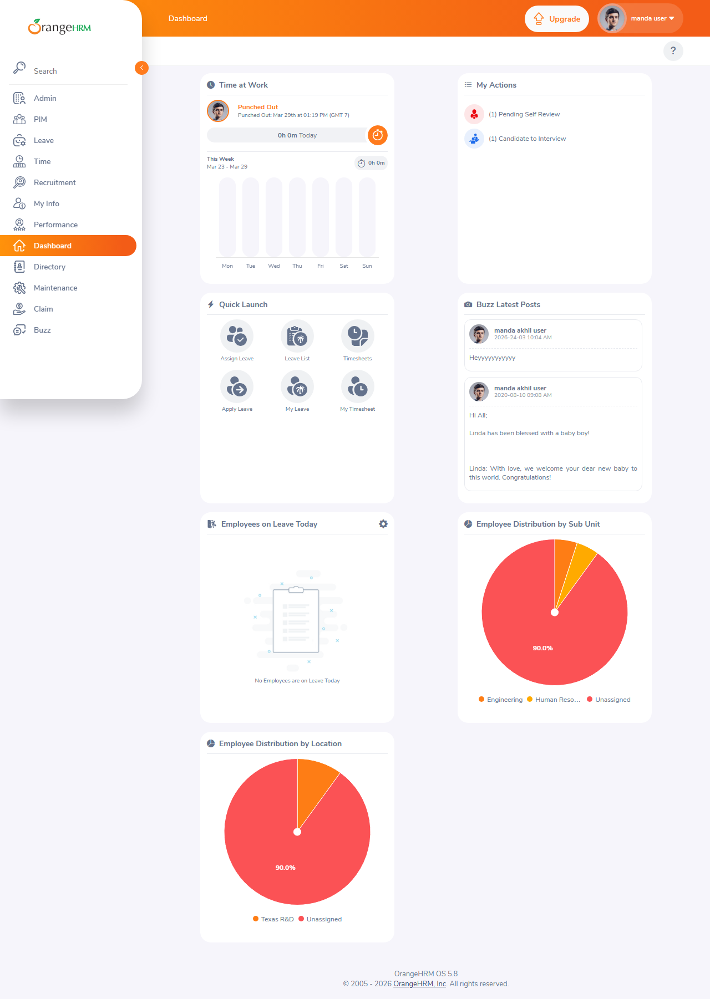 |
| LP-51 | **Session** persists across navigation within the app until logout or timeout. |  (return to Dashboard while logged in) |
| LP-52 | **Direct URL to login** while authenticated — behavior per spec. | **N/A (retest).** Capture locally; reference authenticated UI  |

### 2.7 Forgot password

| ID | Requirement | Screenshot / verification |
|----|-------------|---------------------------|
| LP-60 | “Forgot your password?” area is visible on login page. |  |
| LP-61 | Interaction navigates to password reset flow; URL matches product (observed: `.../auth/requestPasswordResetCode`). | 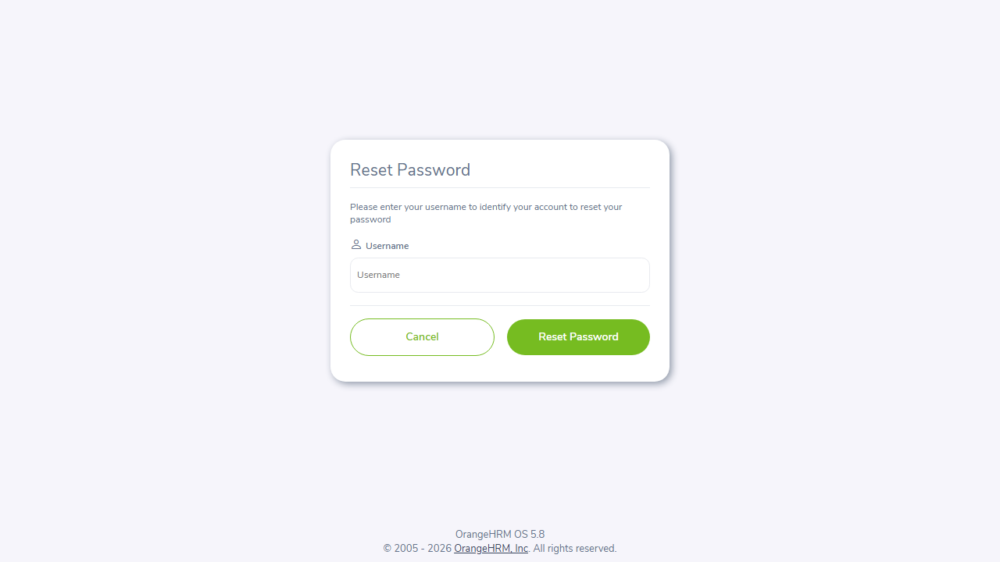 |

### 2.8 Footer — social & legal

| ID | Requirement | Screenshot / verification |
|----|-------------|---------------------------|
| LP-70 | **Social icons** (LinkedIn, Facebook, Twitter/X, YouTube) — correct targets, new tab behavior. |  |
| LP-71 | **Copyright:** “OrangeHRM OS 5.8”, “© 2005 - 2026”, link to OrangeHRM, Inc. |  |
| LP-72 | Footer visible and readable; no overlap with form on small viewports. |  |

### 2.9 Toast / notifications container

| ID | Requirement | Screenshot / verification |
|----|-------------|---------------------------|
| LP-80 | Toast container; error/success messages in expected region (bottom toast on demo). |  |

---

## 3. Post-login — dashboard (home) requirements

**Default landing URL after successful login (observed):**  
`https://opensource-demo.orangehrmlive.com/web/index.php/dashboard/index`

### 3.1 Shell & header

| ID | Requirement | Screenshot / verification |
|----|-------------|---------------------------|
| DB-01 | Page title and header reflect **Dashboard**. |  |
| DB-02 | **User menu** shows logged-in user; dropdown entries (About, Logout, etc.). |  |
| DB-03 | **Upgrade** (or similar) — link behavior. |  |
| DB-04 | Left **side panel** can be toggled (hamburger / layout change). | 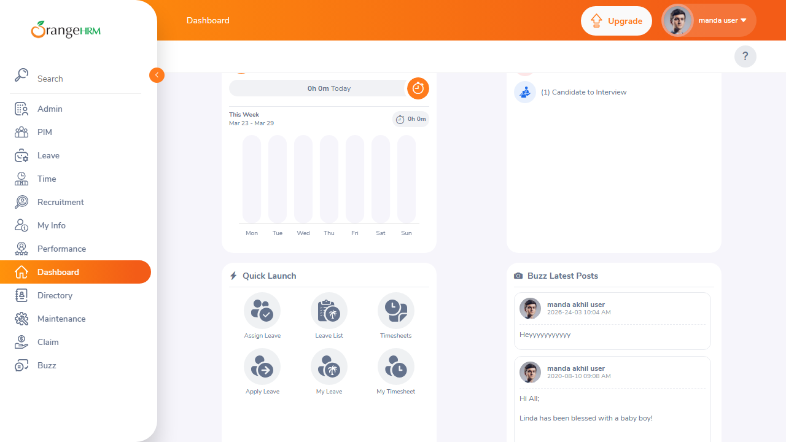 |

### 3.2 Dashboard widgets (observed content — verify per build)

| ID | Requirement | Screenshot / verification |
|----|-------------|---------------------------|
| DB-10 | **Time at Work** widget (punch state, Today / This Week). |  |
| DB-11 | **My Actions** (counts and links). |  |
| DB-12 | **Quick Launch** shortcuts. |  |
| DB-13 | **Buzz Latest Posts.** |  |
| DB-14 | **Employees on Leave Today** (empty or populated). |  |
| DB-15 | **Employee Distribution** by Sub Unit / Location (charts). |  |

### 3.3 Footer (authenticated)

| ID | Requirement | Screenshot / verification |
|----|-------------|---------------------------|
| DB-20 | Footer (version, copyright) on authenticated pages. |  |

---

## 4. Left main menu — menu items, destinations, and validations

**Navigation:** `aside.oxd-sidepanel` → `nav[aria-label="Sidepanel"]` → `ul.oxd-main-menu` → each item is an `a.oxd-main-menu-item` with icon + `.oxd-main-menu-item--name`.

**Search:** Search input in `oxd-main-menu-search` filters menu items.

**Brand header:** Link to `https://www.orangehrm.com/` with logo/banner (`oxd-brand`).

**Base URL for relative links:** `https://opensource-demo.orangehrmlive.com`

**Sidebar appearance (reference):** 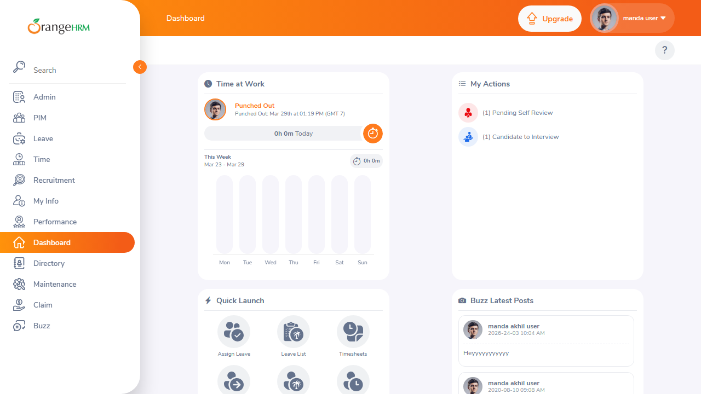

| Order | Menu label | Expected navigation (relative `href`) | Full URL | Screenshot (module landing) |
|------:|------------|----------------------------------------|----------|----------------------------|
| 1 | Admin | `/web/index.php/admin/viewAdminModule` | `https://opensource-demo.orangehrmlive.com/web/index.php/admin/viewAdminModule` | 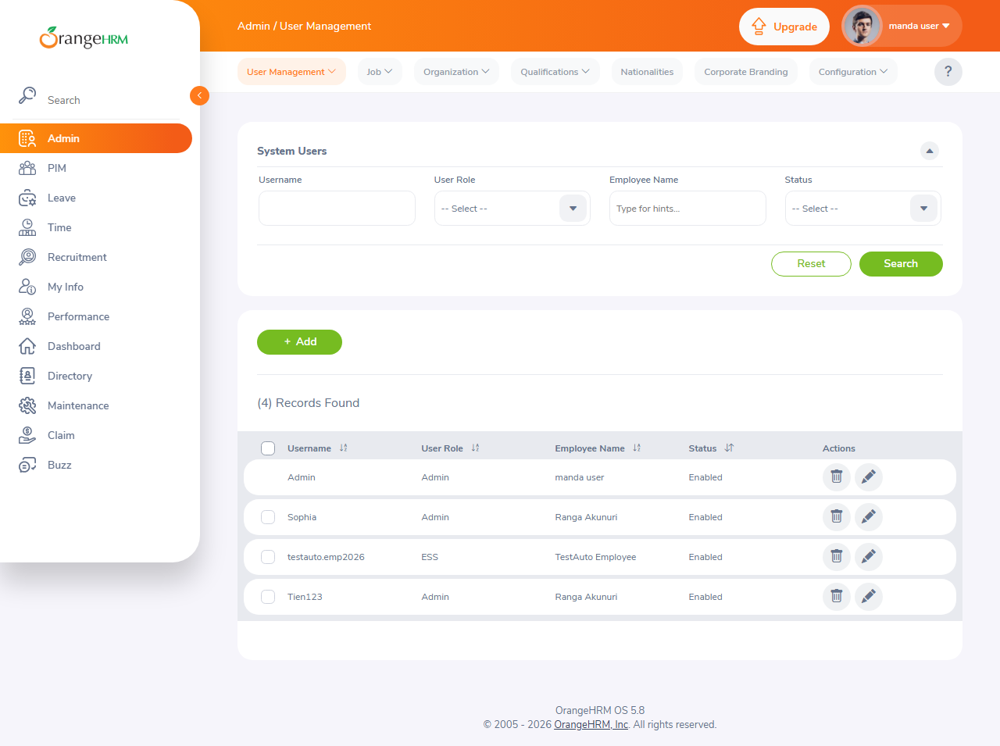 |
| 2 | PIM | `/web/index.php/pim/viewPimModule` | `https://opensource-demo.orangehrmlive.com/web/index.php/pim/viewPimModule` | 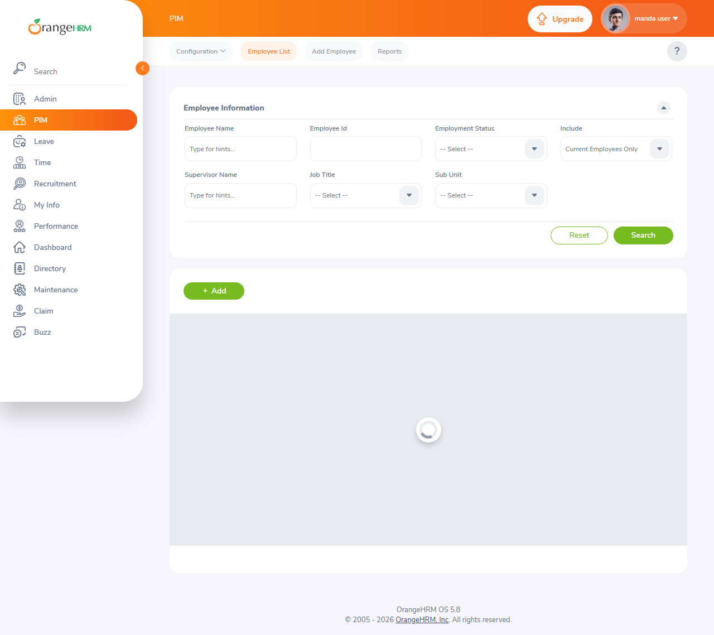 |
| 3 | Leave | `/web/index.php/leave/viewLeaveModule` | `https://opensource-demo.orangehrmlive.com/web/index.php/leave/viewLeaveModule` | 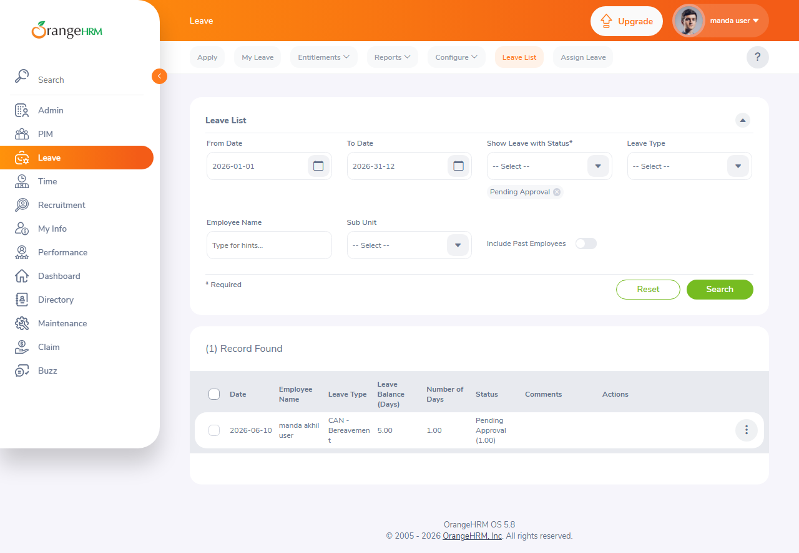 |
| 4 | Time | `/web/index.php/time/viewTimeModule` | `https://opensource-demo.orangehrmlive.com/web/index.php/time/viewTimeModule` | 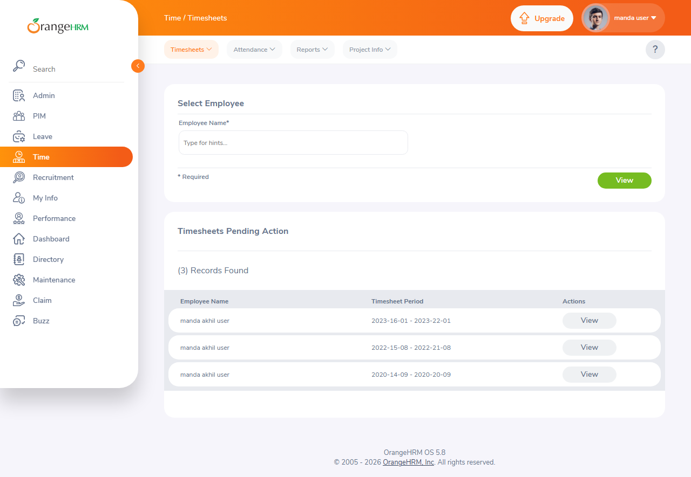 |
| 5 | Recruitment | `/web/index.php/recruitment/viewRecruitmentModule` | `https://opensource-demo.orangehrmlive.com/web/index.php/recruitment/viewRecruitmentModule` | 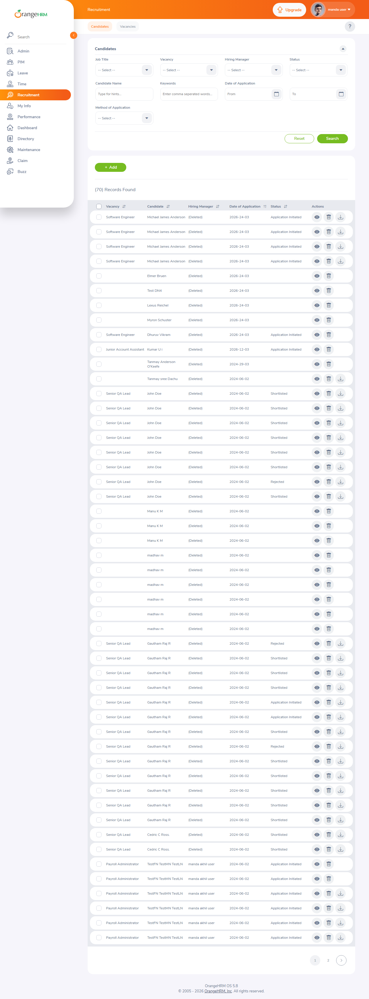 |
| 6 | My Info | `/web/index.php/pim/viewMyDetails` | `https://opensource-demo.orangehrmlive.com/web/index.php/pim/viewMyDetails` | 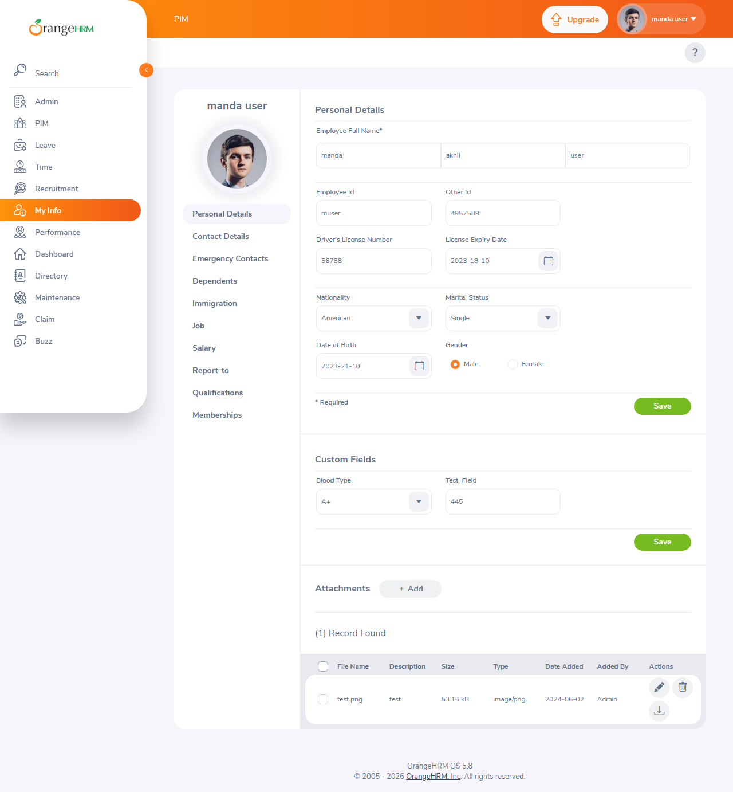 |
| 7 | Performance | `/web/index.php/performance/viewPerformanceModule` | `https://opensource-demo.orangehrmlive.com/web/index.php/performance/viewPerformanceModule` | 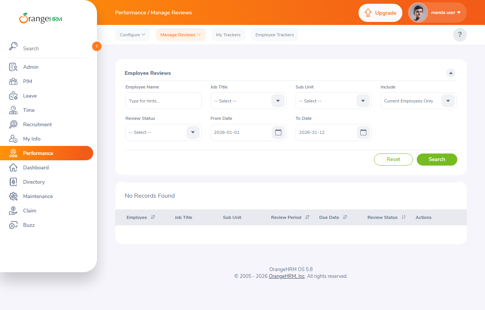 |
| 8 | Dashboard | `/web/index.php/dashboard/index` | `https://opensource-demo.orangehrmlive.com/web/index.php/dashboard/index` |  |
| 9 | Directory | `/web/index.php/directory/viewDirectory` | `https://opensource-demo.orangehrmlive.com/web/index.php/directory/viewDirectory` | 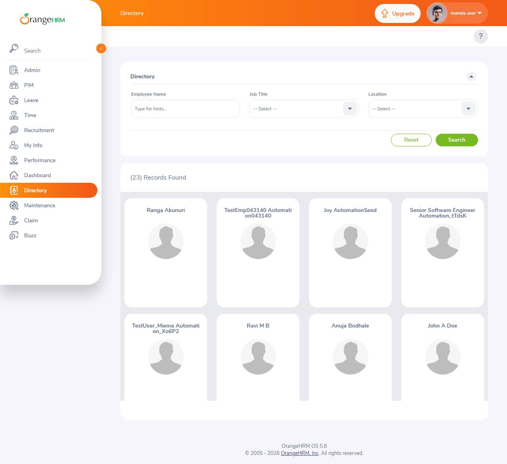 |
| 10 | Maintenance | `/web/index.php/maintenance/viewMaintenanceModule` | `https://opensource-demo.orangehrmlive.com/web/index.php/maintenance/viewMaintenanceModule` | 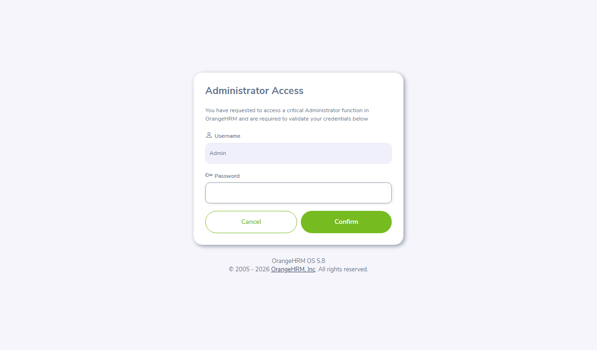 |
| 11 | Claim | `/web/index.php/claim/viewClaimModule` | `https://opensource-demo.orangehrmlive.com/web/index.php/claim/viewClaimModule` | 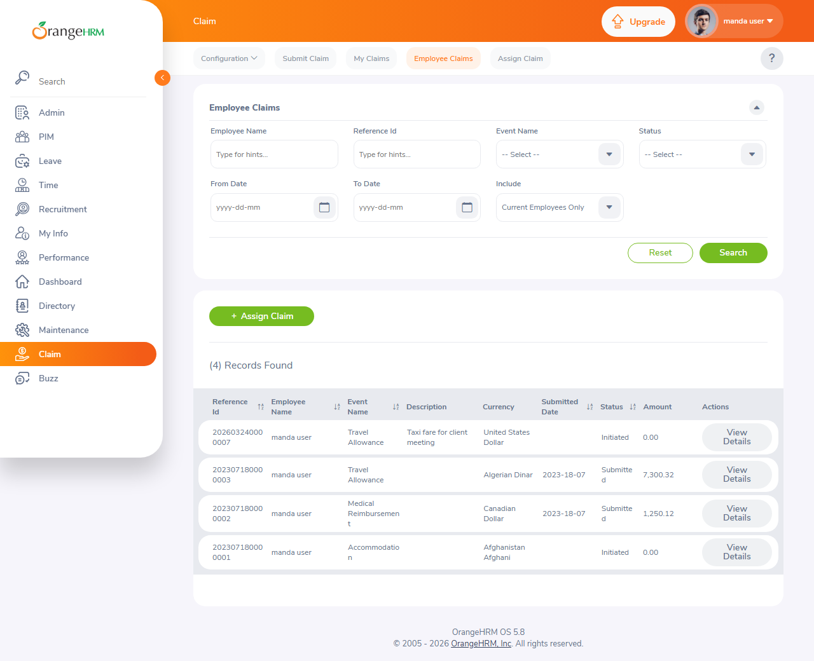 |
| 12 | Buzz | `/web/index.php/buzz/viewBuzz` | `https://opensource-demo.orangehrmlive.com/web/index.php/buzz/viewBuzz` | 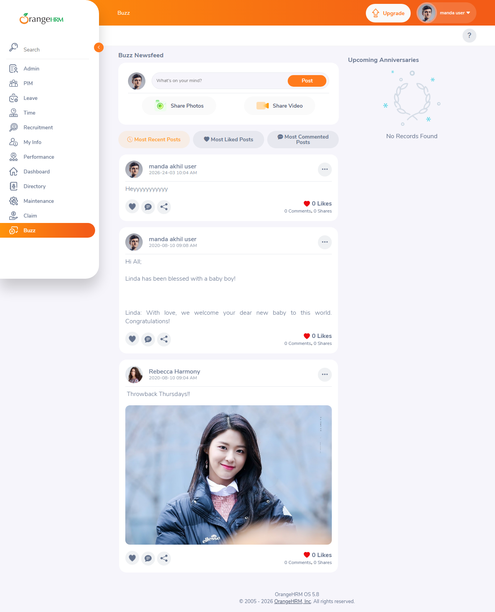 |

### 4.1 Per-item menu requirements

| ID | Requirement | Screenshot / verification |
|----|-------------|---------------------------|
| MN-01 | Each menu item shows **icon + label**; **active** item visually distinct. |  — compare active state on each module screenshot in §4 table. |
| MN-02 | **Click** navigates to exact `href`; address bar matches. | Use §4 **Screenshot** column per module (full-page captures at landing URL). |
| MN-03 | **Keyboard:** Tab / Enter — focus visible. | **N/A (video).** Static reference:  |
| MN-04 | **ARIA:** `nav` with `aria-label="Sidepanel"` (or equivalent). | **N/A (tools).** Inspect DOM on  |
| MN-05 | **Permission:** Users without access — hide or 403. | **N/A** — requires different user roles; document per role matrix. |
| MN-06 | **Deep linking:** Module URL in new tab loads when logged in. | **Same screenshots as §4** (captured via direct navigation while session active). |
| MN-07 | **Module landing:** Sub-tabs / child routes — extend tests per module. | Module landing visuals: §4 screenshots (`menu-01` … `menu-12`). |

---

## 5. Cross-cutting QA checklist (execution)

| Topic | Screenshot / verification |
|-------|---------------------------|
| **5.1 Functional** (logout, regression paths) | End state: logged-out login ; logged-in . |
| **5.2 Security** (HTTPS, headers, CSRF) | **N/A (tools).** Use Network + Security panel; form context . |
| **5.3 Usability & accessibility** | Layout references:  . |
| **5.4 Compatibility** (browsers / responsive) |   |
| **5.5 Performance** | **N/A (tools).** Performance panel / Lighthouse. |
| **5.6 Data & localization** | Date/time visible on . |
| **5.7 Test automation (Playwright)** | **N/A** — use selectors from DOM; visual baseline . |

---

## 6. Traceability summary

| Area | Requirement groups |
|------|---------------------|
| Login | LP-01–LP-80 |
| Dashboard | DB-01–DB-20 |
| Main menu | MN-01–MN-07 + table in §4 |

---

## 7. Screenshot file index (`requirements/screenshots/`)

| File | Description |
|------|-------------|
| `login-full-desktop.png` | Login page, desktop viewport (full page). |
| `login-full-mobile.png` | Login page, iPhone 13 portrait preset (full page). |
| `login-form-fields.png` | Crop: login form (title, demo credentials, fields, button). |
| `login-branding.png` | Crop: company branding image area. |
| `login-password-field-masked.png` | Crop: password field with masked characters. |
| `login-validation-required-fields.png` | Required validation on empty submit. |
| `login-validation-invalid-credentials.png` | Invalid credentials toast/message. |
| `login-validation-long-username.png` | Long text in username field (overflow behavior). |
| `forgot-password-request.png` | Forgot password / reset request page. |
| `dashboard-full-page.png` | Dashboard after successful login (full page). |
| `dashboard-sidebar-menu.png` | Left main menu sidebar. |
| `dashboard-user-dropdown-open.png` | User profile dropdown opened. |
| `dashboard-after-sidebar-toggle.png` | Layout after topbar / sidebar toggle. |
| `menu-01-admin.png` … `menu-12-buzz.png` | Landing view after navigating to each main menu module URL. |

Timestamped originals (`*-2026-03-24T*.png`) are retained in the same folder as duplicates from capture; the **stable** filenames above are the ones referenced by this document.

---

*End of document.*
